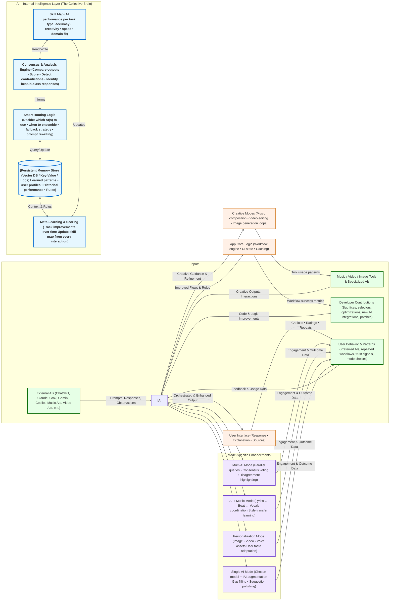

```mermaid
flowchart LR
    subgraph Inputs
        ExternalAIs["External AIs (ChatGPT, Claude, Grok, Gemini, Copilot, Music AIs, Video AIs, etc.)"] -->|Prompts, Responses, Observations| IAI
        MusicVideoTools["Music / Video / Image Tools & Specialized AIs"] -->|Creative Outputs, Interactions| IAI
        Developers["Developer Contributions (Bug fixes, selectors, optimizations, new AI integrations, patches)"] -->|Code & Logic Improvements| IAI
        UserBehavior["User Behavior & Patterns (Preferred AIs, repeated workflows, trust signals, mode choices)"] -->|Feedback & Usage Data| IAI
    end

    subgraph IAICore ["IAI – Internal Intelligence Layer (The Collective Brain)"]
        direction TB
        SkillMap["Skill Map (AI performance per task type: accuracy • creativity • speed • domain fit)"] 
        ConsensusEngine["Consensus & Analysis Engine (Compare outputs • Score • Detect contradictions • Identify best-in-class responses)"]
        RoutingLogic["Smart Routing Logic (Decide: which AI(s) to use • when to ensemble • fallback strategy • prompt rewriting)"]
        MemoryStore[("(Persistent Memory Store (Vector DB / Key-Value / Logs) Learned patterns • User profiles • Historical performance • Rules)")]
        AnalysisScoring["Meta-Learning & Scoring (Track improvements over time Update skill map from every interaction)"]
        
        SkillMap <-->|Read/Write| ConsensusEngine
        ConsensusEngine -->|Informs| RoutingLogic
        RoutingLogic <-->|Query/Update| MemoryStore
        MemoryStore <-->|Context & Rules| AnalysisScoring
        AnalysisScoring -->|Updates| SkillMap
    end

    IAI -->|Orchestrated & Enhanced Output| User["User Interface (Response • Explanation • Sources)"]
    IAI -->|Improved Flows & Rules| AppLogic["App Core Logic (Workflow engine • UI state • Caching)"]
    IAI -->|Creative Guidance & Refinement| CreativeWorkflows["Creative Modes (Music composition • Video editing • Image generation loops)"]

    subgraph ModeEnhancements [Mode-Specific Enhancements]
        MultiAIMode["Multi-AI Mode (Parallel queries • Consensus voting • Disagreement highlighting)"]
        AIMusicMode["AI + Music Mode (Lyrics ↔ Beat ↔ Vocals coordination Style transfer learning)"]
        PersonalizationMode["Personalization Mode (Image • Video • Voice assets User taste adaptation)"]
        SingleAIMode["Single AI Mode (Chosen model + IAI augmentation Gap filling • Suggestion polishing)"]
        
        IAI --> MultiAIMode
        IAI --> AIMusicMode
        IAI --> PersonalizationMode
        IAI --> SingleAIMode
    end

    %% Feedback Loops
    User -->|"Choices • Ratings • Repeats"| UserBehavior
    AppLogic -->|Workflow success metrics| Developers
    CreativeWorkflows -->|Tool usage patterns| MusicVideoTools
    MultiAIMode & AIMusicMode & PersonalizationMode & SingleAIMode -->|Engagement & Outcome Data| UserBehavior

    classDef input fill:#e6ffe6,stroke:#006600,stroke-width:2px
    classDef core fill:#e6f7ff,stroke:#0066cc,stroke-width:2.5px,font-weight:bold
    classDef output fill:#fff0e6,stroke:#cc6600,stroke-width:2px
    classDef modes fill:#f0e6ff,stroke:#6633cc,stroke-width:2px

    class ExternalAIs,MusicVideoTools,Developers,UserBehavior input
    class SkillMap,ConsensusEngine,RoutingLogic,MemoryStore,AnalysisScoring core
    class User,AppLogic,CreativeWorkflows output
    class MultiAIMode,AIMusicMode,PersonalizationMode,SingleAIMode modes

    linkStyle default stroke:#666,stroke-width:1.5px
```
